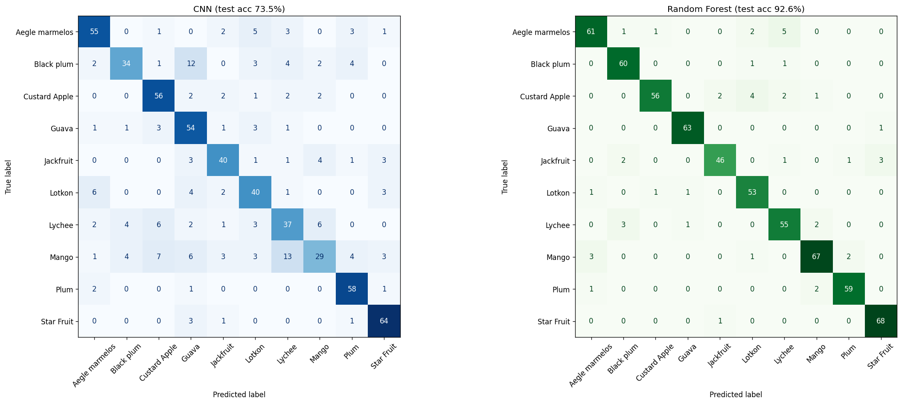

# Fruit-Leaf Classification: Does This Task Actually Need Deep Learning?

A small, honest investigation into **model selection**. I built a Convolutional Neural Network (CNN)
to classify 10 fruit-tree species from their leaves — then asked the question every practitioner should
ask before reaching for deep learning: *is a simpler model good enough?*

It turns out it is. A classical **Random Forest beat the CNN by ~19 points (92.6% vs 73.5%)** on this
dataset. Rather than hide that, this repo treats it as the finding: it diagnoses *why* the CNN lost,
checks the comparison is fair, and tests whether data augmentation can close the gap — to demonstrate
the real skill, **choosing the right tool for the data, with evidence.**

> *Guiding principle (from my deep-learning coursework): if a task can be solved well with classical
> ML, you don't need deep learning. This project is that principle, tested end-to-end.*

---

## TL;DR — the scoreboard

| Model | Test accuracy | Train–test gap | Notes |
|---|---|---|---|
| Small CNN (8 epochs, no augmentation) | **73.5%** | +13.6% | overfit: aced train (87%), fumbled test |
| Small CNN (8 epochs, **+ augmentation**) | 67.1% | **−4.1%** | overfitting eliminated, but needs more epochs to recover accuracy |
| **Random Forest (100 trees, flattened pixels)** | **92.6%** | (train 100% / test 92.6%) | **the winner — and the right tool here** |

**Conclusion:** for this small, color/texture-driven dataset, a Random Forest on raw pixels is more
accurate, far faster to train, and the sensible choice. A from-scratch CNN is the *wrong tool for this
particular job* — not because CNNs are bad, but because the data doesn't play to their strengths.

---

## The dataset

**Multi-Class Fruit Leaf Classification** — Mendeley Data, [DOI 10.17632/4gxzx6h7gv.2](https://data.mendeley.com/datasets/4gxzx6h7gv/2), CC BY 4.0.

- **3,173 images**, **10 balanced classes** (302–343 images each)
- Species: *Aegle marmelos, Black plum, Custard Apple, Guava, Jackfruit, Lotkon, Lychee, Mango, Plum, Star Fruit*
- Whole-image classification, one folder per class (ready for `torchvision.ImageFolder`)
- High-resolution; resized to **64×64** here for fast CPU training

> The raw data (~9.73 GB) is **not** included in this repo. Download it from the link above and place it at
> `data/fruit_leaves/<class folders>` to reproduce.

---

## What I did (and why)

1. **Loaded & inspected** the images (sanity-checked samples and labels before trusting the data).
2. **Built a small CNN** (2 conv layers → pooling → 2 dense layers) and trained it — got **73.5%** on a
   held-out test set.
3. **Added a Random Forest baseline** on flattened pixels — the key rigor move. It scored **92.6%**.
   *A baseline tells you whether deep learning is even worth it.* Here, the "simple" model won decisively.
4. **Investigated why**, three ways:
   - **Train–test gap:** the CNN scored 87% on training but 73.5% on test (a **+13.6% gap** = overfitting,
     i.e. memorizing rather than generalizing).
   - **Leakage check:** confirmed train + test partitions don't overlap and equal the full dataset, so
     the RF's win is real, not the result of seeing test data during training.
   - **Confusion matrices** (CNN vs RF, side by side): the CNN struggled most on *Black plum* and *Mango*,
     and **both** models confuse genuinely look-alike species — turning a single number into insight.
5. **Gave deep learning a fair shot** with data augmentation (random flips, rotation, color jitter on
   training only; test left untouched). The result is instructive: augmentation **eliminated the
   overfitting** (gap flipped from +13.6% to −4.1%), but 8 epochs wasn't enough time for the model to
   relearn on the harder, augmented data — so raw accuracy dropped to 67.1% and still didn't approach RF.



---

## Why the Random Forest wins here (the nuance)

This is **not** "Random Forests beat CNNs." It's "the right model depends on the data." On this dataset:

- **Small data** (~3k images) — CNNs are data-hungry and shine with far more.
- **Color & texture dominate** — leaf species differ in hue/veining/sheen, which a Random Forest reads
  well straight off raw pixels.
- **No transfer learning** — this CNN is trained from scratch; a pretrained backbone (e.g. ResNet) would
  likely change the story.

**CNNs would be expected to win** with much more data, strong spatial dependencies, or transfer learning.
None of those apply here — so the Random Forest is the correct, efficient choice. Knowing *when* each
applies is the point of the project.

---

## Repo structure

```
fruit-leaf-classification-cnn/
├── eda.ipynb               # the full investigation (run this) — load → CNN → RF baseline → diagnosis → augmentation
├── model/
│   └── small_cnn.py        # the SmallCNN architecture
├── figures/
│   └── confusion_matrices.png
├── requirements.txt
├── .gitignore
└── README.md
```

The work lives in **`eda.ipynb`**, which reads top to bottom as the investigation: build the CNN, add the
Random Forest baseline, diagnose the gap / check for leakage / plot confusion matrices, then test augmentation.

## How to reproduce

```bash
pip install -r requirements.txt
# download the dataset from the Mendeley link above into data/fruit_leaves/
jupyter notebook eda.ipynb   # run cells top to bottom
```

## The model

`SmallCNN` (see `model/small_cnn.py`): `Conv(3→16) → ReLU → MaxPool → Conv(16→32) → ReLU → MaxPool →
Flatten → Linear(8192→64) → ReLU → Linear(64→10)`. Trained with CrossEntropyLoss + Adam (lr=0.001) on
64×64 RGB images.

---

## What I'd take to a real version

- A **pretrained backbone** (transfer learning) — the fairest way to give deep learning its best shot.
- **More epochs** for the augmented model, to let it recover and properly test the augmentation hypothesis.
- **Per-class metrics** (precision/recall) beyond accuracy, since the look-alike species matter most.

---

*Dataset: Multi-Class Fruit Leaf Classification (Mendeley, CC BY 4.0). Built as a learning project to
practice rigorous model comparison and honest reporting of results — including the ones that don't go
the way you guessed.*
